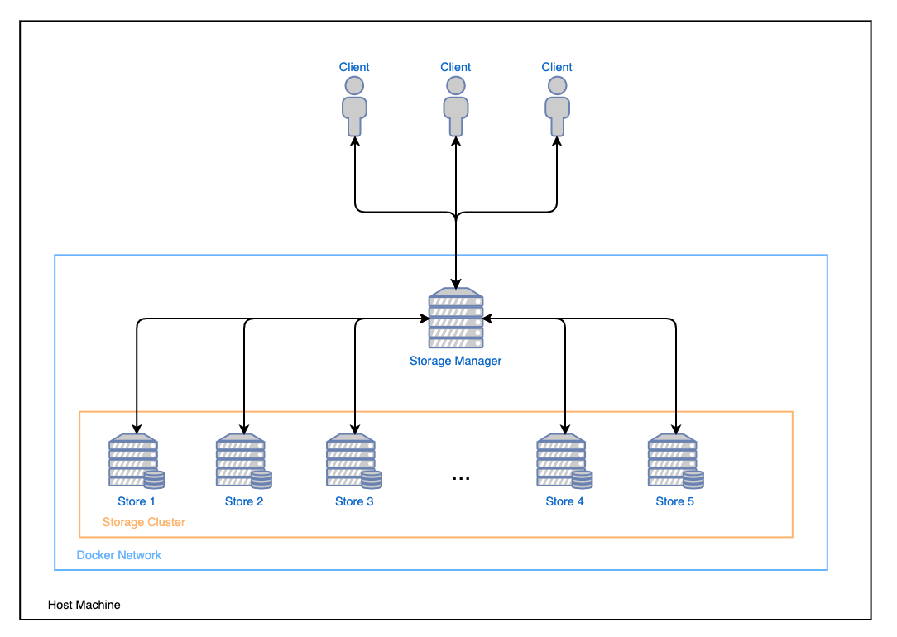

## Balanced Simple Store Service (BS3)
Balanced Simple Store Service (BS3) is a distributed system designed for the companies that cannot use cloud storage as the managed data is sensitive and need to store it internally. The data is organised in buckets and the interesting part is that the contents of each bucket is spread across the system in order to keep balanced the amount of data stored on each machine.

### CLI
* `exit`
* `create <bucket>`
* `upload <local_file> <remote_file> <bucket>`
* `list <bucket>`
* `download <remote_file> <local_file> <bucket>`
* `remove <remote_file> <bucket>`
* `purge <bucket>`

### Infrastructure

