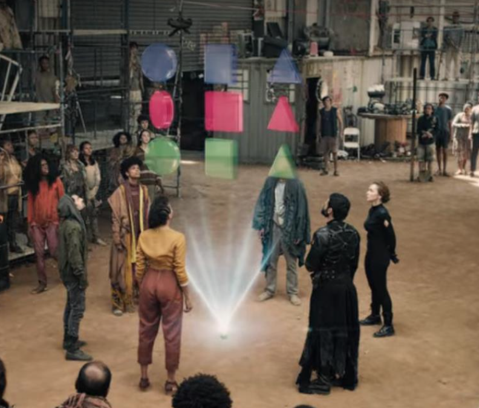
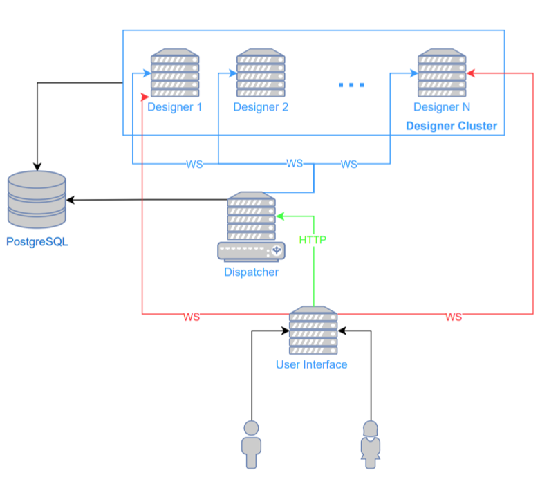
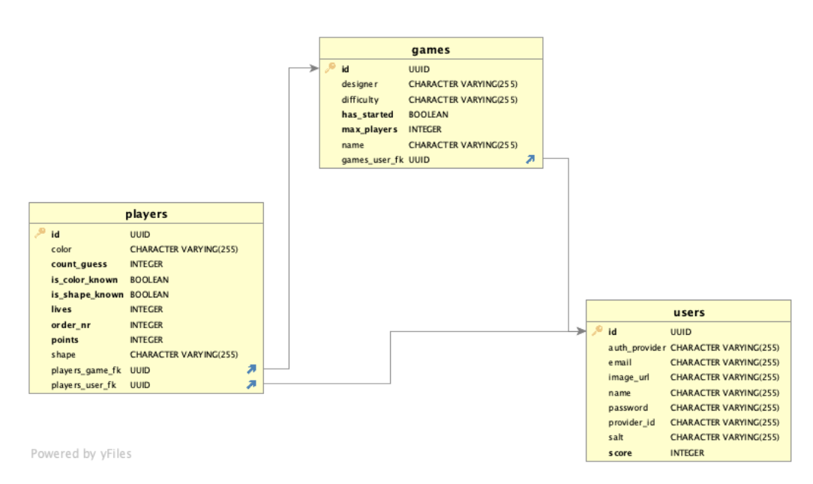
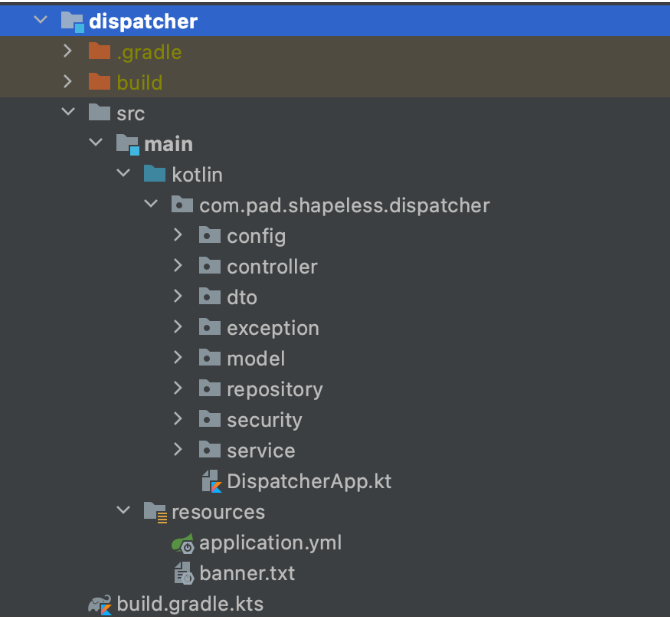
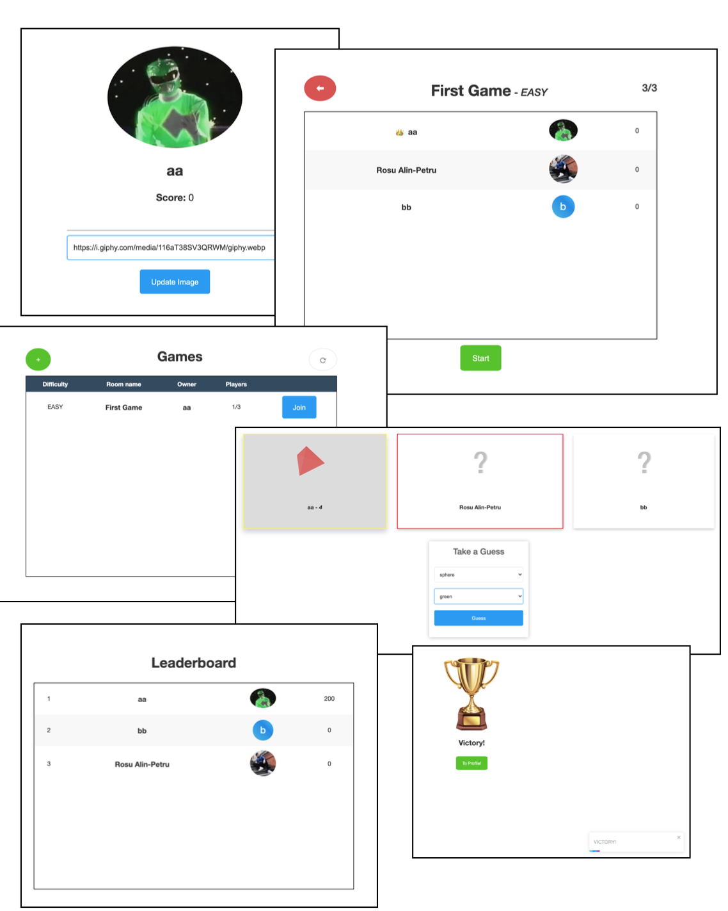

# Shapeless 

## Project General Description

After seeing a TV series (Name: **3%** , Season 4, Episode 7) where this game was played by
the characters, we decided that we shall bring it to life as people might find it intriguing. At first,
the game seems to be based on pure luck. In fact, it also requires good intuition.

The main idea is based on players that join customisable rooms in terms of difficulty and
maximum players. At the beginning, each player receives a coloured 3D shape, one of the
cartesian product between {Sphere, Cube, Pyramid} x {Red, Green, Blue}. Throughout the game,
each player must guess the others shape and color in order to receive points. In case the guess
was wrong, the player will lose a life (the amount of lives is set depending on the games difficulty).
In order to play, a player can either create a new room, or join a lobby of an already
designed room by another player.
The app is designed to kill people’s boredom, but it is more appealing for the youth.

## System Topology

The application is build over a client-server architecture, where the server has two main
responsibilities.
Since the server has two main responsibilities, that are exposing data and respond to
events received from the clients, we split it in two:

- **Dispatcher** : the server that monitors the designers and expose data to the users. It acts like a
    load balancer.
- **Designers** : a horizontally scalable cluster of servers that connect to the dispatcher and serves
    as the business logic of the entire game. Each client will be distributed to one designer
    dynamically.

#### Tech Stack:

- Backend: Kotlin + Gradle + Spring Boot
- Frontend: React + npm + nginx
- DevOps: Docker + Nix

### Dispatcher

One of the main responsibilities of this server is the user management and securing the
connections. When a client joins a lobby, it actually connects via WebSockets (using STOMP
protocol) to the designer to which the game was assigned. This is because we need to provide a
real-time experience to the user (see whenever a player joins/ leaves a lobby, a player makes a
right guess etc.)
The dispatcher server is the manager of the system, while the designers act like workers.
Each designer connects to the dispatcher upon start and provides it with their location so that any
client knows where to open a WebSocket when it joins a game.
The user model is defined within this server and it is the only component that can persist
user data.
In terms of security, this server authorises requests (either WS or HTTP) using bearer
tokens (JWT). Also, the CORS filter is configured such that it can receive requests only inside its
network.

### Designer

The most important responsibility of a designer is to “work” for a dispatcher. Throughout
its lifetime, it will attempt to connect to the dispatcher in case of failures.
The designer cluster contains all the business logic and all means to persist game related
data. A designer does not have a lot of communication with the dispatcher.
Another important responsibility of the designer is to make the application react to events
issued by the clients. The designer implements an event handler for the events generated by the
client. Upon joining a game, the client will open a WS directly to the assigned designer. The CORS
is configured such that requests can be received from outside its network.

### Client

The users have the ability to customise their profile picture, see themselves in a
leaderboard. The users get points based on their gameplay.
In terms of authentication, one can opt to sign up with a Google/ Facebook account
(Facebook is available on in dev mode as Facebook forces that deployed apps use HTTPS) or
create an account on the Shapeless platform.

## Implementation Details

#### A. Security

There are a few unauthorised routes that a user can access in order to authenticate. Any
request to an authorised route goes through a filter that removes it if the bearer token sent in its
header is not valid. Each token is signed with a secret key.
The accounts are also secured using a BCrypt algorithm for hashing and it is also salted.

#### B. Persistance

We used a PostgreSQL database for storing data. The default schema with its tables are
generated at runtime using JPA.

The main entity in the model is the User, while Player and Game describe temporary data.

#### C. Project structure

There are three main modules: Dispatcher, Designer, Shared.
Both Dispatcher and Designer conform to the following structure (source: https://
medium.com/the-resonant-web/spring-boot-2-0-project-structure-and-best-practices-
part-2-7137bdcba7d3):

For a clean dependency configuration, we used an incubating feature of Gradle, version
catalogs + TOML configurations.
The Shared modules contains DTOs used for the communication between the Dispatcher
and the Designer.

#### D. Handling secrets

The app depends on a lot of secrets:

- Facebook/ Google Client Id & Secret
- Database credentials
- Token Sign Key

In order not to leak sensitive data in our repository, we used .env files + IDE extensions (for
both IntelliJ and Visual Studio Code) to export the file’s content as environment variables at
runtime. We will discuss more about secrets in terms of deployment in the following section.

## Deployment

#### A. Containerising

The is meant to run in docker containers which were configured using docker-compose
with the correspondent YAML file. All containers run on localhost.
The secrets are also secured using _secrets_ feature of Docker. All secrets were installed as
simple text files on the host machine (physical). Using a specialised entry-point script, we
exported the content of each file as environment variables inside containers. (See the convention
of managing secrets for images published on DockerHub).

#### B. Internet Accessibility

The app was accessible on _shapeless.go.ro_ during our presentation_._ The _.go.ro_ is a
domain held by DIGI (RCS & RDS). They offer a Dynamic Domain Name System (DDNS) service
for all customers and the ability to give name to the subdomain, thus making you computer visible
on the internet.
Of course, in order to be reachable, we need to forward ports and create allow ports by
creating firewall rules.
Currently, we changed our subdomain as we needed it for projects of other subjects.

#### C. Building

The frontend image is built solely using a Dockerfiles. It consists of two phases, first for
creating the optimised production build (using npm) and the second for exposing it using nginx.
The backed images are built using a more sophisticated method, by using Nix. When
referring to Nix, one can speak about:

- NixOS - functional operating system
- functional package manager
- Nix expression language - pure, lazy, functional language
What we used Nix for is to abstract over the notion of _build_ , as being a function with input
the source code + build dependencies (e.g.: Gradle) and output the jar file. Nix provides an
isolated environment for build and it makes it reliable as no side-effects occur in our workspace
and the state of our machine cannot interfere with the build process. For talking more about Nix
would take over 100 pages, so we resume to what has already been said. (Documentation:
https://nixos.org/manual/nix/stable/)
After we obtain the jars, the docker images are build immediately after.

#### D. Automation

We did not implement any kind of automation for deploying our application, but we have in
mind two possible solutions:

_1. Partial automation_

Using Nix, we can run some scripts that can fetch the source code from GitHub, build the
apps, build the docker images and deploy the new containers. For versioning we can use the rev
of the current commit.
In order to deploy we need to run just one script, but this still implies human interaction.

_2. Full Automation_

We could install Jenkins which will redeploy the app based on GitHub webhooks.

## Design

